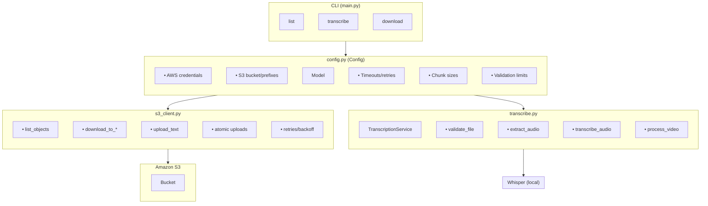
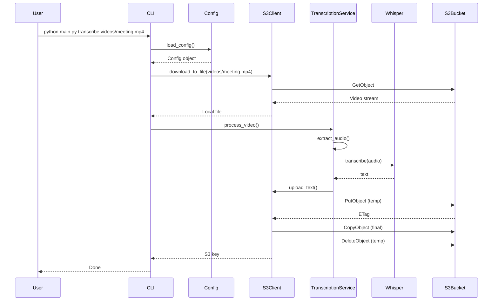

# Meetings Transcript

Transcribe videos from Amazon S3 to text using OpenAI Whisper. This application downloads videos from S3, extracts audio, transcribes using Whisper, and uploads the resulting text back to S3.

---

## Table of Contents

- [Features](#features)
- [Architecture](#architecture)
- [Sequence Diagram](#sequence-diagram)
- [Prerequisites](#prerequisites)
- [Installation](#installation)
- [Configuration](#configuration)
- [Usage](#usage)
- [CLI Examples](#cli-examples)
- [AWS IAM Permissions](#aws-iam-permissions)
- [Running with LocalStack (Emulator)](#running-with-localstack-emulator)
- [Troubleshooting](#troubleshooting)

---

## Features

- **S3 Integration**: List, download, and upload objects from Amazon S3
- **Whisper Transcription**: Local transcription using OpenAI Whisper model
- **Audio Extraction**: Extract audio from video files using ffmpeg
- **Chunking Support**: Process large files by splitting into chunks
- **Atomic Uploads**: Safe uploads to S3 using temporary keys and copy operations
- **Resilient**: Exponential backoff retries for transient errors
- **Secure**: Credentials never logged; secret redaction in logs

---

## Architecture



---

## Sequence Diagram



---

## Prerequisites

- Python 3.8+
- AWS credentials or IAM role with S3 access
- ffmpeg (for audio extraction)
- GPU with CUDA (optional, for faster transcription)

---

## Installation

1. **Clone the repository**:
   ```bash
   git clone https://github.com/creep1ng/meetings-transcript.git
   cd meetings-transcript
   ```

2. **Create virtual environment**:
   ```bash
   python -m venv .venv
   source .venv/bin/activate  # Linux/Mac
   # or
   .venv\Scripts\activate     # Windows
   ```

3. **Install dependencies**:
   ```bash
   pip install -r requirements.txt
   ```

4. **Install ffmpeg** (required for audio extraction):
   ```bash
   # Ubuntu/Debian
   sudo apt-get install ffmpeg
   
   # macOS
   brew install ffmpeg
   
   # Windows
   choco install ffmpeg
   ```

---

## Configuration

Copy `.env.example` to `.env` and fill in your values:

```bash
cp .env.example .env
```

### Source Configuration

The application supports two sources for videos:
- **local** (default): Process local video files or folders
- **s3**: Process videos from Amazon S3 bucket

You can configure the default source in `.env`:

```env
SOURCE=local  # Default source
```

Or override with the `--source` CLI flag:

```bash
# Use S3 for this command only
python main.py --source s3 list
python main.py --source s3 transcribe videos/meeting.mp4

# Use local for this command only
python main.py --source local transcribe ./my_videos
```

### S3 Configuration

Required when using S3 source:

```env
# AWS Credentials
AWS_ACCESS_KEY_ID=your_access_key_id
AWS_SECRET_ACCESS_KEY=your_secret_access_key
AWS_REGION=us-east-1

# S3 Bucket
S3_BUCKET_NAME=your-bucket-name
VIDEO_PREFIX=videos/
TRANSCRIPTS_PREFIX=transcripts/
```

### Transcription Settings

```env
MODEL_SIZE=small                     # tiny, base, small, medium, large, turbo
DEVICE=cpu                           # cpu or cuda
TRANSCRIPT_CHUNK_SECONDS=0           # 0 to disable chunking
DOWNLOAD_CHUNK_BYTES=10485760        # 10MB for streaming

# Timeouts
S3_TIMEOUT=300
TRANSCRIPTION_TIMEOUT=3600
MAX_RETRIES=3
```

---

## Usage

### List available videos

```bash
python main.py list
```

Output:
```
Key                                                         Size      Last Modified
-----------------------------------------------------------------------------------------------
videos/meeting_jan_2024.mp4                               125.43MB  2024-01-15 14:30:00
videos/team_sync.wav                                       45.21MB  2024-01-16 09:15:00

Total: 2 videos
```

### Transcribe a specific video

```bash
python main.py transcribe videos/meeting_jan_2024.mp4
```

### Transcribe all videos

```bash
python main.py transcribe --all
```

### Transcribe with chunking (for large files)

```bash
python main.py transcribe videos/large_meeting.mp4 --transcript-chunk 120
```

### Download a transcription

```bash
python main.py download transcripts/meeting_jan_2024.mp4.txt
```

### Download to specific directory

```bash
python main.py download transcripts/meeting_jan_2024.mp4.txt -o ./output
```

---

## CLI Examples

### Local source examples

```bash
# List local files
python main.py list

# Transcribe single file
python main.py transcribe video.mp4

# Transcribe folder with batch processing
python main.py transcribe ./recordings --all

# Transcribe with output directory
python main.py transcribe video.mp4 -o ./transcriptions

# Transcribe with chunking
python main.py transcribe large_video.mp4 --transcript-chunk 120 -o ./transcriptions
```

### S3 source examples

```bash
# List S3 videos
python main.py --source s3 list

# Transcribe from S3
python main.py --source s3 transcribe videos/meeting.mp4

# Transcribe all from S3 bucket
python main.py --source s3 transcribe --all
```

### Environment-based source

Set default source in `.env`:
```env
SOURCE=s3
```

Then use without flags:
```bash
python main.py list              # Lists from S3
python main.py transcribe --all  # Transcribes all from S3
```

### Full workflows

**Local workflow:**
```bash
# 1. List local files
python main.py list ./videos

# 2. Transcribe with chunking
python main.py transcribe ./videos/large_meeting.mp4 --transcript-chunk 120 -o ./transcripts

# 3. View result
cat ./transcripts/large_meeting.txt
```

**S3 workflow:**
```bash
# 1. List S3 videos
python main.py --source s3 list

# 2. Transcribe from S3
python main.py --source s3 transcribe videos/team_meeting.mp4

# 3. Download transcription
python main.py download transcripts/team_meeting.mp4.txt -o ./downloads
```

### With custom environment file

```bash
python main.py --env production.env list
python main.py --env production.env transcribe videos/meeting.mp4
```

### With verbose logging

```bash
python main.py --log-level DEBUG transcribe videos/meeting.mp4
```

---

## AWS IAM Permissions

Create an IAM policy with these permissions:

```json
{
    "Version": "2012-10-17",
    "Statement": [
        {
            "Effect": "Allow",
            "Action": [
                "s3:ListBucket"
            ],
            "Resource": "arn:aws:s3:::YOUR_BUCKET_NAME"
        },
        {
            "Effect": "Allow",
            "Action": [
                "s3:GetObject",
                "s3:PutObject",
                "s3:DeleteObject",
                "s3:CopyObject"
            ],
            "Resource": [
                "arn:aws:s3:::YOUR_BUCKET_NAME/videos/*",
                "arn:aws:s3:::YOUR_BUCKET_NAME/transcripts/*"
            ]
        }
    ]
}
```

Attach this policy to a user or role. If running on EC2, use an IAM instance profile instead.

---

## Running with LocalStack (Emulator)

For local development without AWS:

1. **Start LocalStack**:
   ```bash
   docker run -d -p 4566:4566 localstack/localstack
   ```

2. **Create bucket**:
   ```bash
   aws --endpoint-url=http://localhost:4566 s3 mb s3://test-bucket
   ```

3. **Upload test video**:
   ```bash
   aws --endpoint-url=http://localhost:4566 s3 cp video.mp4 s3://test-bucket/videos/
   ```

4. **Configure .env**:
   ```env
   AWS_ACCESS_KEY_ID=test
   AWS_SECRET_ACCESS_KEY=test
   AWS_REGION=us-east-1
   S3_BUCKET_NAME=test-bucket
   ```

5. **Run CLI**:
   ```bash
   python main.py list
   python main.py transcribe videos/video.mp4
   ```

---

## Troubleshooting

### Credential errors

Ensure AWS credentials are set correctly:
```bash
aws configure
# or set environment variables
export AWS_ACCESS_KEY_ID=your_key
export AWS_SECRET_ACCESS_KEY=your_secret
```

### ffmpeg not found

Ensure ffmpeg is in your PATH:
```bash
ffmpeg -version
```

### CUDA out of memory

Use CPU instead:
```bash
DEVICE=cpu python main.py transcribe video.mp4
```

### Large file chunking

For files > 500MB, enable chunking:
```bash
python main.py transcribe large_video.mp4 --transcript-chunk 120
```

---

## License

MIT License
