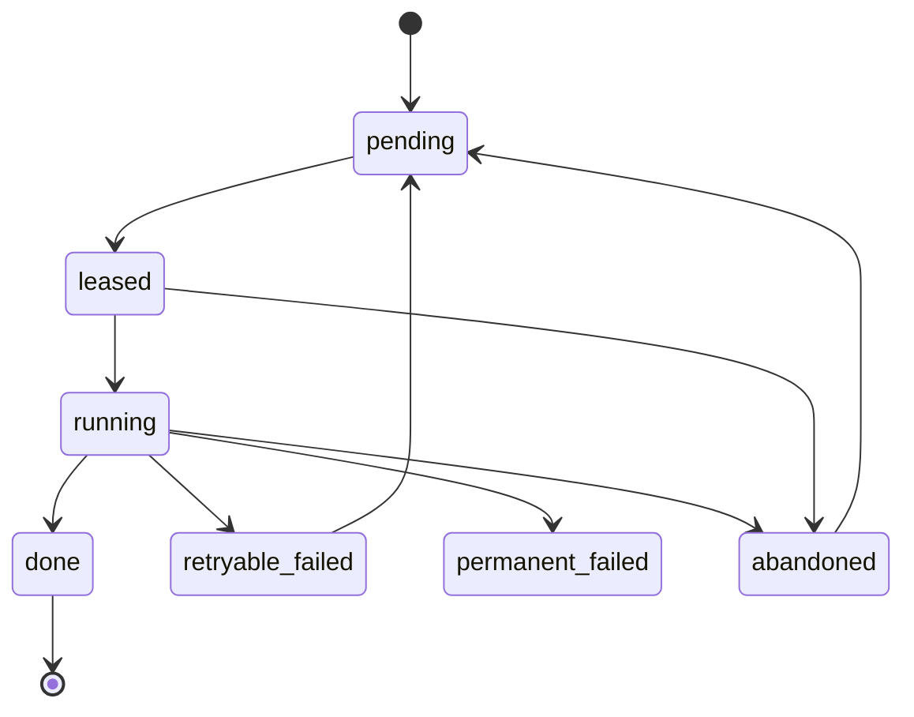

# EC2 Spot-safe per-chunk checkpointing architecture (SQLite sidecar)

## 0. Scope and assumptions

This design targets the current transcription pipeline in [`main.py`](main.py:1) and [`transcribe.py`](transcribe.py:1), which:

- Downloads S3 objects to a local temp directory and processes them sequentially per file in [`main.py`](main.py:139).
- Implements chunked transcription inside a single process (splits audio into chunk WAVs and transcribes each sequentially) via [`TranscriptionService._transcribe_with_chunking()`](transcribe.py:291).

Constraints from the task:

- Checkpoints must be **per chunk**.
- Checkpoint DB must be **SQLite** and must live in the **same storage component** as inputs:
  - Local inputs → DB next to local input files.
  - S3 inputs → DB stored in S3 (same bucket) near the input’s logical namespace.

Assumptions (explicit so implementation can change them later):

- One EC2 instance generally processes **one file at a time**; intra-file chunk parallelism is optional.
- Multi-instance concurrency is possible (ASG/Spot Fleet), so we must prevent two instances from processing the same file/chunks concurrently.

---

## 1. High-level architecture (checkpoint per chunk)

### 1.1 Key idea

For each source file (local path or S3 key), create a durable **work namespace** consisting of:

1. A **SQLite checkpoint DB** that tracks the job/file/chunk state transitions.
2. **Per-chunk artifacts** (chunk transcript outputs) written idempotently.
3. A **final transcript artifact** produced only after all chunks are done.

The checkpoint DB is the source of truth for planned chunks and their statuses; artifacts are immutable outputs used for idempotency and recovery.

### 1.2 Storage placement

#### Local inputs

Given a local input file:

- Input: `/data/videos/meeting.mp4`
- Work namespace (same filesystem / storage component):
  - DB: `/data/videos/.mt_checkpoints/meeting/ckpt.sqlite`
  - Chunk transcripts: `/data/videos/transcripts/meeting/chunks/chunk_0000.txt`
  - Final transcript: `/data/videos/transcripts/meeting/meeting.txt`

#### S3 inputs

Given an S3 input object:

- Input: `s3://bucket/videos/meeting.mp4`
- Work namespace (same bucket / storage component):
  - DB: `s3://bucket/checkpoints/videos/meeting.mp4/ckpt.sqlite`
  - Chunk transcripts: `s3://bucket/transcripts/meeting/chunks/chunk_0000.txt`
  - Final transcript: `s3://bucket/transcripts/meeting/meeting.txt`

Notes:

- The exact prefixes can be configured via env vars (similar to [`Config.video_prefix`](config.py:23) and [`Config.transcripts_prefix`](config.py:24)).
- The DB is stored in S3 but **never opened directly over S3**; it is always used via a local working copy and then synced back.

---

## 2. Consistency strategy

### 2.1 Principles

- **Single writer** per SQLite DB at a time.
- **Idempotent outputs** per chunk, so retries do not corrupt final results.
- **Append-only event trail** (in DB) for debugging and operational safety.
- **Crash-only design**: at any time, killing the process must leave either:
  - A committed DB state that can be resumed, or
  - Outputs that can be reconciled into DB state.

### 2.2 SQLite settings

For local filesystem DB usage:

- Enable WAL mode:
  - `PRAGMA journal_mode=WAL;`
- Durability:
  - `PRAGMA synchronous=FULL;` for maximum safety.
  - Optionally `NORMAL` if throughput is critical and the surrounding system tolerates rework.
- Concurrency:
  - Use `BEGIN IMMEDIATE` for state transitions to avoid writers blocking later.
- Busy handling:
  - `PRAGMA busy_timeout=5000;`

For S3-backed DB:

- Still use WAL mode locally.
- Before uploading back to S3, force checkpoint into the main DB file:
  - `PRAGMA wal_checkpoint(TRUNCATE);`
  - Close the connection.
- Upload only the single consolidated `ckpt.sqlite` file (do not upload `-wal` or `-shm`).

### 2.3 Atomic writes for chunk outputs

#### Local outputs

Write each chunk transcript using write-ahead + rename:

1. Write to temp: `chunk_0000.txt.tmp`.
2. `fsync()` the file.
3. `os.rename()` to `chunk_0000.txt` (atomic on same filesystem).
4. `fsync()` the parent directory.

Then (in a separate SQLite transaction) mark chunk as `done` with:

- `transcript_path`
- `transcript_sha256`
- `completed_at`

This ordering ensures that a DB state claiming `done` implies the artifact exists.

#### S3 outputs

S3 object PUT is atomic per object, and this repo already implements a temp-key + copy pattern in [`S3Client.upload_from_stream()`](s3_client.py:263).

Adopt the same pattern for chunk outputs:

- Upload to: `transcripts/.tmp/<uuid>_chunk_0000.txt`
- Copy to: `transcripts/meeting/chunks/chunk_0000.txt`
- Delete temp

Then update the SQLite DB and sync it to S3.

### 2.4 Ordering and two-phase safety

Because DB and artifacts are separate objects (especially in S3), strict atomicity across both is not possible. We mitigate with **reconciliable invariants**:

- Primary invariant: `chunk.status = done` ⇒ output artifact exists and matches expected hash.
- Recovery invariant: if output artifact exists but DB says not done, the runner can:
  1. Hash/verify artifact.
  2. Transition DB chunk status to `done` without re-running transcription.

This makes the system robust against:

- Spot termination between output upload and DB upload.
- Spot termination between DB update and DB upload.

### 2.5 Idempotency strategy

Chunk identity must be deterministic.

Define chunk identity as:

- `source_fingerprint` (changes when input changes)
- `chunk_plan` (chunk_seconds, boundaries)
- `chunk_index`

Recommended `source_fingerprint`:

- Local: `(path, size_bytes, mtime_ns)` or preferably a content hash if feasible.
- S3: `(bucket, key, etag, size_bytes, last_modified)`.

Store `chunk_plan_hash = sha256(json(chunk_seconds, boundaries, language, model_size, provider_version))`.

For each chunk, store:

- `audio_chunk_sha256` (optional but ideal if chunk WAVs are persisted)
- `transcript_sha256`

Chunk output path/key should be stable and deterministic (based on `chunk_index`).

If a chunk output already exists:

- Verify against DB hash (if present).
- If match: skip transcription and mark `done` (or keep `done`).
- If mismatch: mark `corrupt` and re-generate output to a new revision key, preserving the old artifact.

---

## 3. Spot interruption handling plan

### 3.1 Interruption sources/signals

Implement at least two detection mechanisms:

1. **IMDSv2 Spot interruption notice** (most reliable)
   - Endpoint: `http://169.254.169.254/latest/meta-data/spot/instance-action`
   - When interruption is scheduled, response includes action and time; otherwise 404.
   - Use IMDSv2 token:
     - PUT token to `http://169.254.169.254/latest/api/token` with header `X-aws-ec2-metadata-token-ttl-seconds`.

2. **Process signals**
   - `SIGTERM` (system shutdown / termination)
   - `SIGINT` (operator stop)

Optional additional sources:

- EventBridge + CloudWatch Events for Spot interruption notifications.
- ASG lifecycle hooks (terminate hook) to extend drain time; still design for 2-minute hard limit.

### 3.2 Graceful shutdown algorithm (2-minute window)

Implement a shutdown coordinator used by the main transcription loop:

1. On receiving interruption notice:
   - Set `draining = true`.
   - Stop leasing new files/chunks.
   - Record `jobs.shutdown_requested_at` and reason.

2. For the currently running chunk:
   - If remaining time is sufficient, finish transcription and write output.
   - If not sufficient, abort transcription promptly and mark chunk attempt as `abandoned`.

3. Flush checkpoint DB:
   - Commit any open transaction.
   - `wal_checkpoint(TRUNCATE)`.
   - Close DB.

4. Sync to durable storage:
   - Local: DB already durable; ensure artifacts are on disk.
   - S3: upload consolidated DB to its S3 key.

5. Release lease:
   - Mark `leases` row as released.
   - Delete or expire the S3 lock object.

Key behavior: the last successful state written must be a checkpoint that allows safe restart with no double-processing.

---

## 4. Relaunch and retry automation options

### 4.1 ASG with Spot instances (practical default)

Pattern:

- Auto Scaling Group with MixedInstancesPolicy (Spot + optional On-Demand base).
- User-data bootstrap:
  - Install dependencies.
  - Fetch config (SSM Parameter Store or baked AMI).
  - Start a systemd worker service.

Work distribution options:

- **SQS queue of file keys** (recommended): each worker leases and processes one file.
- **S3 listing scan**: each worker lists and claims work via S3 lease objects.

### 4.2 systemd unit + user-data bootstrap

- Create a unit `meetings-transcript-worker.service` that runs a wrapper command like:
  - `python main.py transcribe --source s3 --all`

For checkpointing, this wrapper must be updated to:

- Claim work per file with a lease.
- Resume from checkpoints.

systemd should use:

- `Restart=always`
- `RestartSec=10`
- `KillSignal=SIGTERM`
- `TimeoutStopSec=120`

### 4.3 Step Functions orchestration

Step Functions is useful when you want deterministic retries and centralized visibility.

Options:

- **Per-file state machine**:
  - Task: run an ECS task / AWS Batch job that processes a file to completion using chunk checkpoints.
  - Retry policy: handle transient failures.

- **Per-chunk state machine**:
  - Harder, because SQLite checkpoint becomes a shared mutable artifact.
  - If you go this route, treat SQLite as per-file and only written by one worker at a time; Step Functions drives chunk tasks but uses a single writer pattern.

Given the SQLite requirement, per-file Step Functions is usually the cleanest.

---

## 5. SQLite schema proposal

### 5.1 Entity model

- **job**: an execution run (batch) with configuration snapshot.
- **file**: a source media file (local path or S3 key).
- **chunk**: a deterministic chunk of that file.
- **attempt**: a try at processing a file or chunk.
- **lease**: ownership to prevent concurrent processing.
- **event_log**: append-only debugging trail.

### 5.2 Status values

Chunks:

- `pending` → `leased` → `running` → `done`
- `running` → `retryable_failed` (transient error)
- `running` → `permanent_failed` (validation / unsupported)
- `leased` or `running` → `abandoned` (Spot termination / worker crash)
- Any → `corrupt` (artifact mismatch)

Files:

- `pending` → `running` → `done`
- `running` → `retryable_failed` or `permanent_failed`

### 5.3 Concrete DDL (proposal)

```sql
PRAGMA foreign_keys = ON;

CREATE TABLE IF NOT EXISTS jobs (
  job_id            TEXT PRIMARY KEY,
  created_at        TEXT NOT NULL,
  updated_at        TEXT NOT NULL,
  source_type       TEXT NOT NULL,           -- local | s3
  config_json       TEXT NOT NULL,
  status            TEXT NOT NULL,           -- running | done | failed | draining
  shutdown_reason   TEXT,
  shutdown_requested_at TEXT
);

CREATE TABLE IF NOT EXISTS files (
  file_id           TEXT PRIMARY KEY,
  job_id            TEXT NOT NULL REFERENCES jobs(job_id) ON DELETE CASCADE,
  source_uri        TEXT NOT NULL,           -- file:///... or s3://bucket/key
  source_fingerprint TEXT NOT NULL,          -- includes etag or mtime
  discovered_at     TEXT NOT NULL,
  status            TEXT NOT NULL,
  total_chunks      INTEGER NOT NULL,
  done_chunks       INTEGER NOT NULL DEFAULT 0,
  final_output_uri  TEXT,
  final_output_sha256 TEXT,
  last_error        TEXT,
  updated_at        TEXT NOT NULL,
  UNIQUE(job_id, source_uri, source_fingerprint)
);

CREATE TABLE IF NOT EXISTS chunks (
  chunk_id          TEXT PRIMARY KEY,
  file_id           TEXT NOT NULL REFERENCES files(file_id) ON DELETE CASCADE,
  chunk_index       INTEGER NOT NULL,
  start_seconds     REAL NOT NULL,
  end_seconds       REAL NOT NULL,
  chunk_plan_hash   TEXT NOT NULL,
  status            TEXT NOT NULL,
  lease_owner       TEXT,
  lease_expires_at  TEXT,
  attempt_count     INTEGER NOT NULL DEFAULT 0,
  transcript_uri    TEXT,
  transcript_sha256 TEXT,
  last_error        TEXT,
  started_at        TEXT,
  completed_at      TEXT,
  updated_at        TEXT NOT NULL,
  UNIQUE(file_id, chunk_index, chunk_plan_hash)
);

CREATE TABLE IF NOT EXISTS attempts (
  attempt_id        TEXT PRIMARY KEY,
  chunk_id          TEXT REFERENCES chunks(chunk_id) ON DELETE CASCADE,
  file_id           TEXT REFERENCES files(file_id) ON DELETE CASCADE,
  worker_id         TEXT NOT NULL,           -- instance_id:pid or similar
  started_at        TEXT NOT NULL,
  ended_at          TEXT,
  outcome           TEXT,                    -- success | retryable_failed | permanent_failed | abandoned
  error_message     TEXT
);

CREATE TABLE IF NOT EXISTS leases (
  lease_id          TEXT PRIMARY KEY,
  scope             TEXT NOT NULL,           -- file | chunk
  scope_id          TEXT NOT NULL,
  worker_id         TEXT NOT NULL,
  acquired_at       TEXT NOT NULL,
  expires_at        TEXT NOT NULL,
  released_at       TEXT
);

CREATE TABLE IF NOT EXISTS event_log (
  event_id          TEXT PRIMARY KEY,
  ts                TEXT NOT NULL,
  level             TEXT NOT NULL,
  entity_type       TEXT,
  entity_id         TEXT,
  message           TEXT NOT NULL,
  data_json         TEXT
);

CREATE INDEX IF NOT EXISTS idx_chunks_status ON chunks(status);
CREATE INDEX IF NOT EXISTS idx_chunks_lease ON chunks(lease_expires_at);
```

### 5.4 Heartbeats and lease renewal

- Worker periodically renews its active lease (e.g., every 15 seconds) by updating `lease_expires_at`.
- If a worker dies (Spot interruption without cleanup), the next worker can reclaim chunks whose `lease_expires_at < now`.

For S3, mirror the lease in an S3 lock object (see next section) to prevent two writers from uploading competing DB revisions.

---

## 6. S3-backed SQLite: limitations and mitigations

### 6.1 The limitation

SQLite requires POSIX-like file semantics. S3 is object storage and does not support byte-range locking or atomic rename. Therefore:

- You cannot safely open a SQLite DB file directly from S3.
- Multi-writer concurrency across instances cannot be supported by SQLite alone.

### 6.2 Safe pattern: local working copy + exclusive lease + periodic sync

For each file namespace:

1. Acquire an **exclusive lease** for the file namespace.
2. Download `ckpt.sqlite` from S3 (if exists), else initialize new.
3. Open locally with WAL enabled.
4. Process chunks, writing chunk outputs to S3 and updating local DB.
5. Periodically (and on shutdown):
   - checkpoint WAL into main db
   - upload DB back to S3 with optimistic concurrency

Exclusive lease ensures a single active writer for a given file’s DB.

### 6.3 Lease implementation in S3 (practical)

Create a lock object:

- Key: `checkpoints/videos/meeting.mp4/lock.json`
- Body: `{ worker_id, acquired_at, expires_at, fencing_token }`

Acquire using a conditional write:

- `PutObject` with header `If-None-Match: *` (succeeds only if the lock does not exist)

Renew by overwriting the lock only if the caller still owns it:

- Read lock, verify `fencing_token`, then overwrite.

If a lock is stale (`expires_at` in the past), allow a new worker to steal it by overwriting and emitting an event (this is operationally acceptable for Spot).

Mitigation for split-brain:

- Use a monotonically increasing `fencing_token` stored in the SQLite DB; every upload increments it. Writers that do not hold the current token must not upload.

### 6.4 Optimistic concurrency for DB upload

When uploading `ckpt.sqlite`:

- Fetch current S3 object ETag (or VersionId if bucket versioning is enabled).
- Upload new DB to temp key, then copy to final key only if the expected ETag/version matches.

If the conditional copy fails, re-download and reconcile.

---

## 7. Chunk state machine



File-level completion:

- File is `done` only when all chunks for the active `chunk_plan_hash` are `done` and final transcript artifact is written.

---

## 8. Operational runbook snippets

### 8.1 Resume behavior

On startup for each candidate file:

1. Acquire file lease.
2. Load checkpoint DB (download if S3).
3. Ensure chunk plan exists; if not, create chunk rows.
4. Loop:
   - pick next chunk with status in `pending`, `retryable_failed`, `abandoned`
   - lease chunk
   - run transcription
   - write chunk artifact
   - mark chunk done
5. When all chunks done:
   - assemble final transcript deterministically
   - write final artifact
   - mark file done
6. Sync DB (for S3).

### 8.2 Handling stuck work after Spot termination

Symptoms:

- Chunks stuck in `leased` or `running`.

Resolution:

- If `lease_expires_at` is in the past, new worker can reclaim.
- If S3 lock object exists but is stale, steal it and proceed, recording an `event_log` entry.

### 8.3 Corruption detection

If `chunk.status = done` but the corresponding artifact is missing:

- Mark chunk as `corrupt`.
- Transition back to `pending` and re-run.

If artifact exists but hash mismatches DB:

- Preserve old artifact by copying to a quarantine key.
- Regenerate chunk output.

### 8.4 Inspecting the DB locally

For local inputs, DB is at `.mt_checkpoints/<file>/ckpt.sqlite`.

- List failed chunks:
  - `SELECT chunk_index, status, last_error FROM chunks WHERE status != 'done';`

For S3 inputs, download DB:

- `aws s3 cp s3://bucket/checkpoints/.../ckpt.sqlite ./ckpt.sqlite`

---

## 9. Implementation notes for this repo

This repo currently performs chunking inside [`TranscriptionService._transcribe_with_chunking()`](transcribe.py:291) without persisting per-chunk transcript artifacts.

To implement this design, the pipeline should evolve toward:

- Extract audio once in [`TranscriptionService.process_video()`](transcribe.py:320).
- Build deterministic chunk boundaries in one place.
- For each chunk:
  - produce chunk transcript artifact
  - checkpoint to SQLite
- Finally assemble output.

S3 uploads should reuse the atomic temp+copy approach already present in [`S3Client.upload_from_stream()`](s3_client.py:263).

---

## 10. Summary of key design decisions

- SQLite is used as the canonical per-file checkpoint store; one writer at a time is enforced via leases.
- Chunk outputs are stable, deterministic artifacts to enable idempotency and recovery.
- WAL mode is used locally; for S3 sync we checkpoint WAL into a single DB file before upload.
- Spot interruptions are handled via IMDSv2 polling + SIGTERM trap, with a drain path that flushes artifacts and checkpoints within 2 minutes.
- Automation is achievable with ASG + systemd worker, optionally integrating SQS for work distribution.
